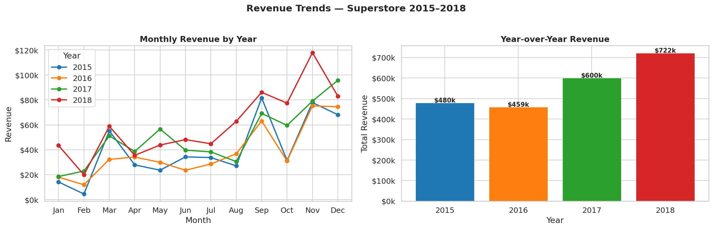
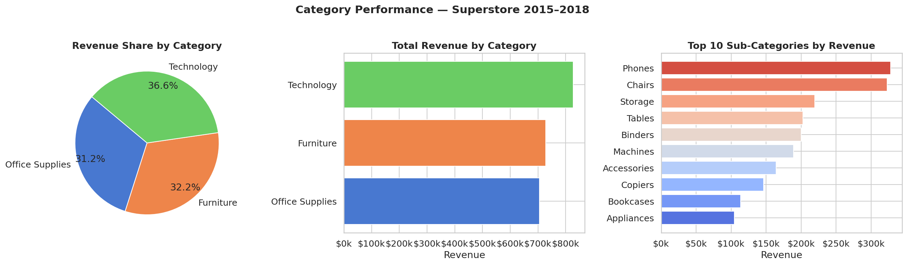
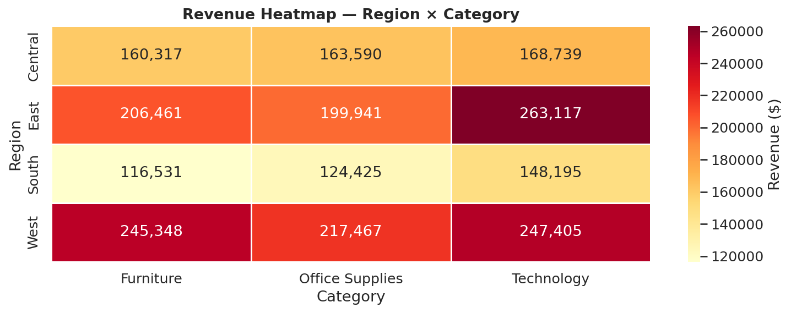
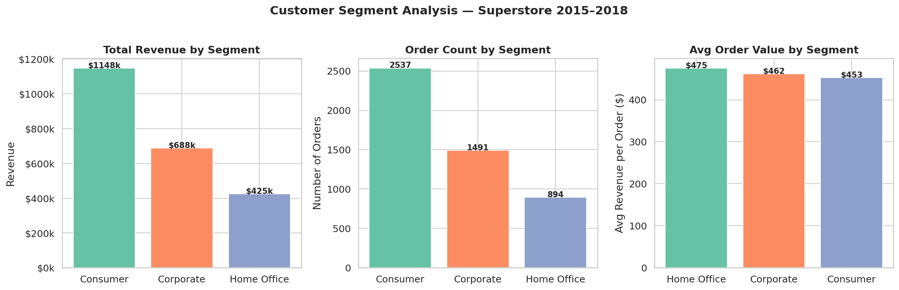
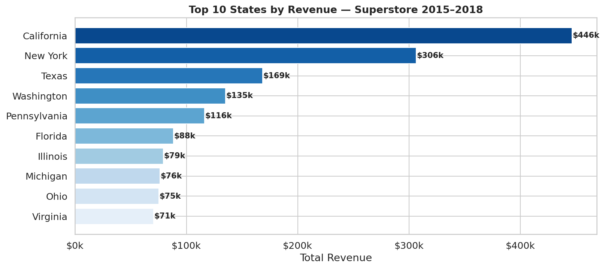

# 📊 Superstore Sales Analysis (2015–2018)

An end-to-end exploratory data analysis (EDA) project on a real US retail dataset — covering data cleaning, feature engineering, and five business-focused visualisations using Python.

---

## 📁 Repository Contents

| File | Description |
|---|---|
| `Superstore_Sales_Analysis.ipynb` | Main analysis notebook |
| `sales_data.csv` | Superstore Sales Dataset (source: Kaggle) |
| `monthly_revenue.png` | Monthly revenue trend + YoY comparison |
| `category_breakdown.png` | Category & sub-category revenue breakdown |
| `region_category_heatmap.png` | Heatmap of revenue by region & category |
| `segment_analysis.png` | Customer segment: revenue, orders, avg order value |
| `top_states.png` | Top 10 US states by total revenue |
| `requirements.txt` | Python dependencies |

---

## 🔍 What the Analysis Covers

- **Dataset:** 9,800 real retail orders across 4 years (2015–2018)
- **Data Cleaning:** Missing value handling, date parsing, feature engineering (Year, Month, Quarter, Days to Ship)
- **Key Metrics:** Total revenue, avg order value, top category, top state, top segment
- **Visualisations:**
  - Monthly revenue trend — all years overlaid + year-over-year bar chart
  - Category & top-10 sub-category revenue breakdown (pie + bar)
  - Region × Category revenue heatmap
  - Customer segment analysis (revenue, order count, avg order value)
  - Top 10 US states by revenue

---

## 📈 Sample Charts

### Monthly Revenue & Year-over-Year Growth


### Category & Sub-Category Breakdown


### Region × Category Heatmap


### Customer Segment Analysis


### Top 10 States by Revenue


---

## 🚀 Getting Started

### 1. Clone the repo
```bash
git clone https://github.com/rohanbhosalerb/Sales-Analytics.git
cd Sales-Analytics
```

### 2. Install dependencies
```bash
pip install -r requirements.txt
```

### 3. Open the notebook
```bash
jupyter notebook Superstore_Sales_Analysis.ipynb
```

---

## 🛠️ Tech Stack

| Tool | Purpose |
|---|---|
| **Python 3.8+** | Core language |
| **Pandas** | Data loading, cleaning, aggregation |
| **NumPy** | Numerical operations |
| **Matplotlib** | Chart generation |
| **Seaborn** | Statistical visualisations |
| **Jupyter Notebook** | Interactive analysis environment |

---

## 💡 Key Insights

- **Technology** is the top-revenue category across all 4 years
- **West region** leads in total sales; California is the #1 state
- **Q4 seasonality** is strong — consistently the highest-revenue quarter each year
- **Consumer segment** drives the most orders; **Corporate** has a higher average order value
- Revenue grew year-on-year from 2015 to 2018

---

## 📦 Dataset Source

**Superstore Sales Dataset** — available on [Kaggle](https://www.kaggle.com/datasets/rohitsahoo/sales-forecasting)

---

## 📄 License

MIT

---

*Part of my data analytics portfolio — [linkedin.com/in/bhosale-rohan](https://linkedin.com/in/bhosale-rohan)*
